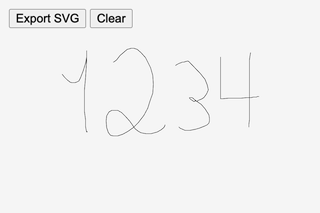

# Index of p5.plotSvg Examples

These examples show how to generate plotter-friendly SVGs from p5.js using p5.plotSvg. All examples are mirrored in collections at [editor.p5js.org](https://editor.p5js.org/golan/collections/MCA5RvDFX) and [openProcessing.org](https://openprocessing.org/curation/88363).

---

### ⭐ [plotSvg_smorgasbord](plotSvg_smorgasbord/README.md) ⭐ 

**Full demonstration of all p5.js drawing primitives exported to SVG.** [here](plotSvg_smorgasbord/README.md) • [@editor](https://editor.p5js.org/golan/sketches/QReF_9ss2) • [@openProcessing](https://openprocessing.org/sketch/2455426)

---

### [plotSvg_hello_static](plotSvg_hello_static/README.md)

Simplest possible demo, in "static" mode; all art is in `setup()` only. [here](plotSvg_hello_static/README.md) • [@editor](https://editor.p5js.org/golan/sketches/AW8GI36fA) • [@openProcessing](https://openprocessing.org/sketch/2455362)

---

### [plotSvg_hello_animating](plotSvg_hello_animating/README.md)

Simple demo; uses `setup()`, `draw()` and a keypress to capture an SVG during animation. [here](plotSvg_hello_animating/README.md) • [@editor](https://editor.p5js.org/golan/sketches/JA-ty5j83) • [@openProcessing](https://openprocessing.org/sketch/2455390)

---

### [plotSvg_generative](plotSvg_generative/README.md)

Simple "generative artwork"; press a button to export. [here](plotSvg_generative/README.md) • [@editor](https://editor.p5js.org/golan/sketches/LRTXmDg2q) • [@openProcessing](https://openprocessing.org/sketch/2455399)

---

### [plotSvg_drawing_recorder](plotSvg_drawing_recorder/README.md)

Records a series of marks drawn by the user. [here](plotSvg_drawing_recorder/README.md) • [@editor](https://editor.p5js.org/golan/sketches/bQDM5IQdv) • [@openProcessing](https://openprocessing.org/sketch/2478914)

---

### [plotSvg_particle_paths](plotSvg_particle_paths/README.md)

Accumulates the traces of some particles over time. [here](plotSvg_particle_paths/README.md) • [@editor](https://editor.p5js.org/golan/sketches/1Toe-pMZH) • [@openProcessing](https://openprocessing.org/sketch/2478945)

---

### [plotSvg_hatched_shapes](plotSvg_hatched_shapes/README.md)

A trick for exporting hatched ("filled") SVG shapes. [here](plotSvg_hatched_shapes/README.md) • [@editor](https://editor.p5js.org/golan/sketches/b75oVci5f) • [@openProcessing](https://openprocessing.org/sketch/2479519)

---

### [plotSvg_instancemode](plotSvg_instancemode/README.md)

Using p5.plotSvg in p5's [instance mode](https://github.com/processing/p5.js/wiki/Global-and-instance-mode). [here](plotSvg_instancemode/README.md) • [@editor](https://editor.p5js.org/Ucodia/sketches/xO8vTRzP7)

---

### [plotSvg_post_grouping](plotSvg_post_grouping/README.md)

Merge groups of paths computed at different times. [here](plotSvg_post_grouping/README.md) • [@editor](https://editor.p5js.org/golan/sketches/aWfRPvVfT) • [@openProcessing](https://openprocessing.org/sketch/2684018)

---

### [plotSvg_svg_font_text](plotSvg_svg_font_text/README.md)

Use monoline SVG fonts in your exported designs. 
[here](plotSvg_svg_font_text/README.md) • [@editor](https://editor.p5js.org/golan/sketches/rIsRh01Vj) • [@openProcessing](https://openprocessing.org/sketch/2684135)

---

### [plotSvg_face_flipbook](https://openprocessing.org/sketch/2488219)

Exports a tiny flipbook recording from a face-tracker. [here](plotSvg_face_flipbook/sketch.js) • [@openProcessing](https://openprocessing.org/sketch/2488219)

