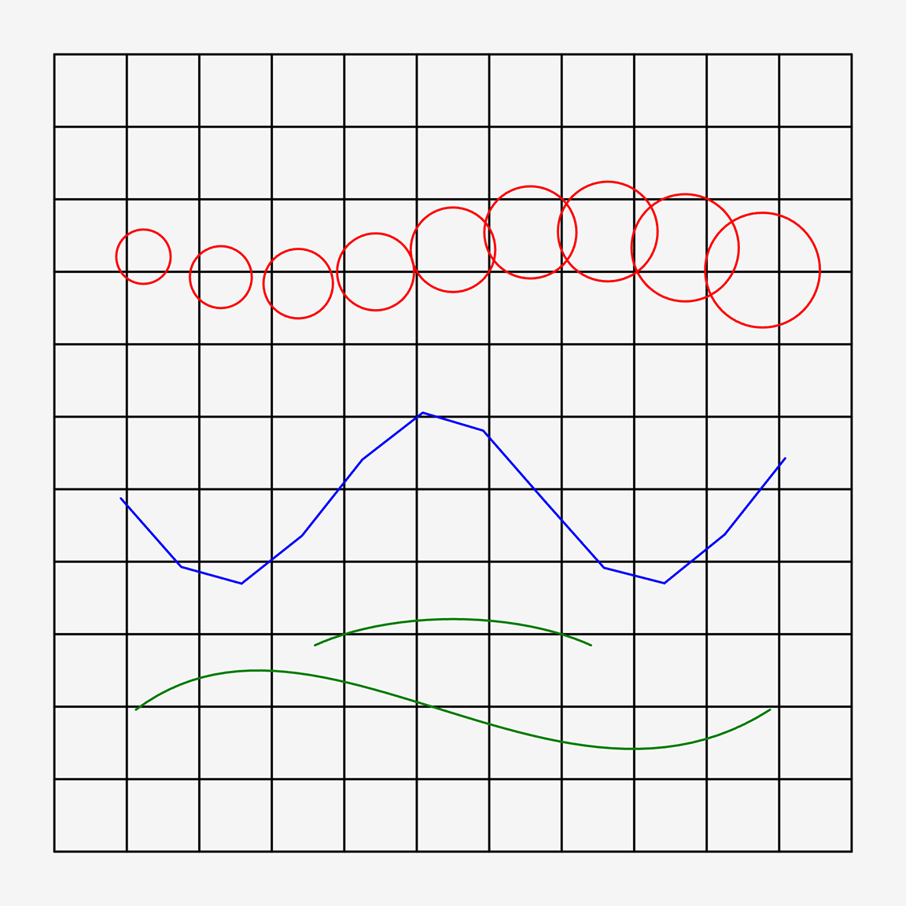

# p5.plotSvg Add-on Example

This example demonstrates the use of p5.plotSvg's add-on-style API across a small 2x2
matrix:

- p5.js v1, global mode: [plotSvg_addon_example_v1_global](plotSvg_addon_example_v1_global/index.html)
- p5.js v1, instance mode: [plotSvg_addon_example_v1_instance](plotSvg_addon_example_v1_instance/index.html)
- p5.js v2, global mode: [plotSvg_addon_example_v2_global](plotSvg_addon_example_v2_global/index.html)
- p5.js v2, instance mode: [plotSvg_addon_example_v2_instance](plotSvg_addon_example_v2_instance/index.html)



The global-mode sketches export with:

```js
beginRecordSvg("output.svg");
drawAddonExampleScene();
endRecordSvg();
```

The instance-mode sketches export with:

```js
p.beginRecordSvg("output.svg");
drawAddonExampleScene();
p.endRecordSvg();
```

Each project loads the generated `dist/p5.plotSvg.js` build so the example
matches the add-on release surface.
