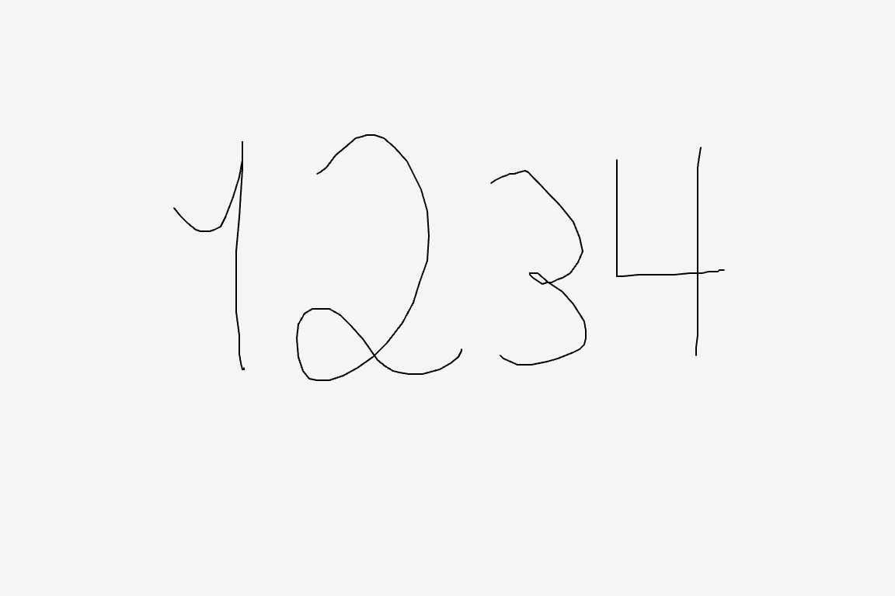

# plotSvg_drawing_recorder Example

The `plotSvg_drawing_recorder` example records a series of marks drawn by the user, and exports an SVG file when the 's' key is pressed.



Code: 

* At editor.p5js.org: [https://editor.p5js.org/golan/sketches/bQDM5IQdv](https://editor.p5js.org/golan/sketches/bQDM5IQdv)
* At openprocessing.org: [https://openprocessing.org/sketch/2478914](https://openprocessing.org/sketch/2478914)
* At Github: [sketch.js](https://raw.githubusercontent.com/golanlevin/p5.plotSvg/refs/heads/main/examples/plotSvg_drawing_recorder/sketch.js)


```
// plotSvg_drawing_recorder Example
// This sketch records a series of marks drawn by the user
// and exports an SVG file when the 's' key is pressed.
// 
// Requires: https://cdn.jsdelivr.net/npm/p5.plotsvg@latest/lib/p5.plotSvg.js
// See: https://github.com/golanlevin/p5.plotSvg

p5.disableFriendlyErrors = true; 
let bDoExportSvg = false; 

let marks = [];
let currentMark = []; 

function setup() {
  // Postcard size: 6"x4" at 96 dpi
  createCanvas(576, 384);
}

function keyPressed(){
  if (key == 's'){
    // Initiate SVG exporting
    bDoExportSvg = true; 
  } else if (key == ' '){
    // Clear recordings with spacebar
    marks = [];
    currentMark = [];
  }
}

function mousePressed(){
  currentMark = [];
  currentMark.push(createVector(mouseX, mouseY)); 
}
function mouseDragged(){
  currentMark.push(createVector(mouseX, mouseY)); 
}
function mouseReleased(){
  if (currentMark){
    marks.push(currentMark); 
  }
}

function draw(){
  background(245); 
  strokeWeight(1);
  stroke(0);
  noFill();
  
  if (bDoExportSvg){
    // Begin exporting, if requested
    beginRecordSVG(this, "plotSvg_drawing_recorder.svg");
  }

  // Draw each of the stored marks
  for (let j=0; j<marks.length; j++){
    beginShape();
    for (let i=0; i<marks[j].length; i++){
      vertex(marks[j][i].x, marks[j][i].y); 
    }
    endShape(); 
  }
  // Draw the current (active) mark
  beginShape();
  for (let i=0; i<currentMark.length; i++){
    vertex(currentMark[i].x, currentMark[i].y); 
  }
  endShape(); 

  
  if (bDoExportSvg){
    // End exporting, if doing so
    endRecordSVG();
    bDoExportSvg = false;
  }
}
```
