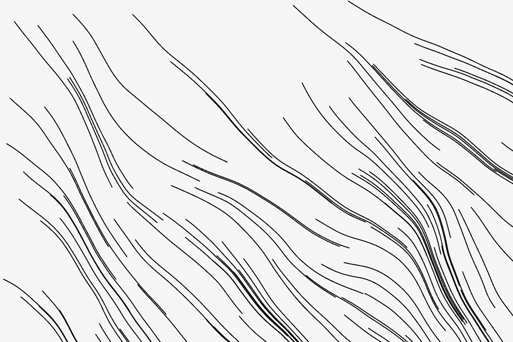

# plotSvg_particle_paths Example

The `plotSvg_particle_paths ` example accumulates the positions of particles as they move over time, and exports these traces as an SVG after 100 frames. (Particles are influenced by a Perlin Noise flow field.) 

**Note**: *This example is written to have simple, brief code. As such, it produces overly-large SVG files that lack information about how the exported points are connected. It would be smarter to record the paths of the particles into dedicated data structures, similar to the [plotSvg_drawing_recorder](../plotSvg_drawing_recorder/README.md) example.*




Code: 

* At editor.p5js.org: [https://editor.p5js.org/golan/sketches/1Toe-pMZH](https://editor.p5js.org/golan/sketches/1Toe-pMZH)
* At openprocessing.org: [https://openprocessing.org/sketch/2478945](https://openprocessing.org/sketch/2478945)
* At Github: [sketch.js](https://raw.githubusercontent.com/golanlevin/p5.plotSvg/refs/heads/main/examples/plotSvg_particle_paths/sketch.js)


```
// plotSvg_particle_paths Example
// Golan Levin, November 2024
//
// Accumulates the positions of particles as they move over time.
// (Particles are influenced by a Perlin Noise flow field.) 
// Exports these traces as an SVG after 100 frames.
// (Note: it would be smarter to store the paths!)
// 
// Requires: https://cdn.jsdelivr.net/npm/p5.plotsvg@latest/lib/p5.plotSvg.js
// See: https://github.com/golanlevin/p5.plotSvg
p5.disableFriendlyErrors = true; 

let bDoExportSvg = false; 
let nRecordingFrames = 100; 
let particles = []; // current positions of the particles

function setup() {
  // Postcard size: 6"x4" at 96 dpi
  createCanvas(576, 384);
  background(245); 
  strokeWeight(1);
  stroke(0);
  noFill();
  
  // Initiate SVG exporting in setup()
  bDoExportSvg = true;
  if (bDoExportSvg){
    setSvgCoordinatePrecision(2); // keep file size small
    beginRecordSVG(this, "plotSvg_particle_paths.svg");
  }
  
  for (let i=0; i<100; i++){
    let rx = random(0,width); 
    let ry = random(0,height); 
    particles.push(createVector(rx,ry)); 
  }
}

function draw(){
  // Accrete each of the stored marks onto the canvas,
  // and update the positions of the particles
  if (bDoExportSvg){
    for (let i=0; i<particles.length; i++){
      let currx = particles[i].x; 
      let curry = particles[i].y; 
      let dx = 3.0 * noise(currx/100, curry/100, 123); 
      let dy = 3.0 * noise(currx/100, curry/100, 345);
      let nextx = currx + dx; 
      let nexty = curry + dy;  
      line(currx,curry, nextx,nexty); 
      particles[i].x = nextx;
      particles[i].y = nexty;
    }
  }
  
  if (frameCount === nRecordingFrames && bDoExportSvg){
    // Export the SVG file.
    endRecordSVG();
    bDoExportSvg = false;
  }
}
```