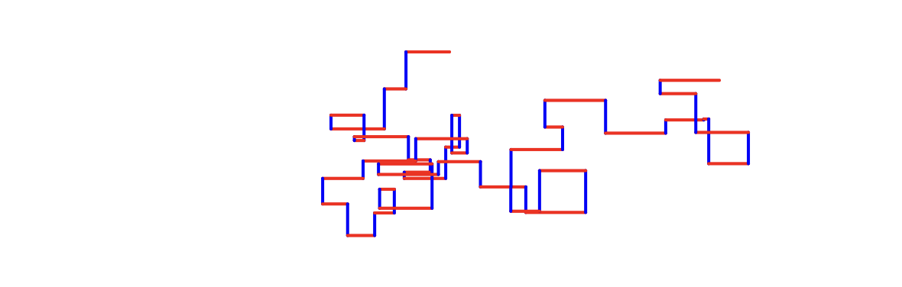

# plotSvg_post_grouping Example

The `plotSvg_post_grouping` example demonstrates how to use the `setSvgMergeNamedGroups()` function to merge groups of SVG paths, even if the paths were computed at different times, *so long as the SVG groups have the same name*. The implementation of this functionality is thanks to the contribution of Lionel Ringenbach ([@Ucodia](https://github.com/ucodia)) and is supported in p5.plotSvg 0.1.5+.

To create a group of paths that are specifically intended to plotted with the same color pen, the `setSvgGroupByStrokeColor()` is a complementary choice. By contrast, the `setSvgMergeNamedGroups()` function is more open-ended, conceptually.

Note that groups created with the `beginSvgGroup()`/`endSvgGroup()` functions will be emitted with Inkscape-specific tags that enable compatibility with Inkscape's "layer" functionality, *unless* the user has called `setSvgInkscapeCompatibility(false)`.



Code: 

* At editor.p5js.org: [https://editor.p5js.org/golan/sketches/aWfRPvVfT](https://editor.p5js.org/golan/sketches/aWfRPvVfT)
* At Github: [sketch.js](https://raw.githubusercontent.com/golanlevin/p5.plotSvg/refs/heads/main/examples/plotSvg_post_grouping/sketch.js)
* A related example by @Ucodia can be found [here](https://editor.p5js.org/golan/sketches/k3xWBNTND)

In the example provided here, a `for` loop in the `draw()` function accumulates 75 steps of a "drunk walk", alternately pushing a tracer at `(px,py)` horizontally and vertically by random amounts. Horizontal movements are shown with a red or blue line, and vertical movements are shown with a black line. In the [resulting SVG](post_grouping.svg), the horizontal lines and vertical lines are each placed into separate SVG groups, e.g.:

```xml
  <g id="horizontalLines" inkscape:groupmode="layer" inkscape:label="1_horizontalLines">
    <line x1="288.0000" y1="192.0000" x2="249.6322" y2="192.0000" style="stroke:blue;"/>
    <line x1="249.6322" y1="162.9929" x2="253.0847" y2="162.9929" style="stroke:red;"/>
    <line x1="253.0847" y1="171.0871" x2="285.8870" y2="171.0871" style="stroke:red;"/>
    ...
```

Program code:

```js
// plotSvg_post_grouping: lines grouped by their color.
// Click to re-generate design; press button to export SVG.
// Demonstrates post-hoc merging of groups, using
// setSvgMergeNamedGroups(true). This function is 
// useful for grouping together lines that are computed
// at different times, but should be executed with the 
// same drawing implement on the plotter.
// Requires p5.plotSvg 0.1.5+

p5.disableFriendlyErrors = true; // hush, p5
let bDoExportSvg = false; 
let myRandomSeed = 12345;

function setup(){
  createCanvas(6 * 96, 4 * 96); // 6x4 inches at 96dpi
  setSvgMergeNamedGroups(true); // Groups elements within a user-defined group

  /* Groups elements with the same color. Uncomment this to see how: */
  // setSvgGroupByStrokeColor(true); 
  
  let saveButton = createButton("Save SVG");
  saveButton.position(10, 10);
  saveButton.mousePressed((event) => {
    event.stopPropagation();
    bDoExportSvg = true;
  });
}

function mousePressed(){
  myRandomSeed = millis(); 
}

function draw(){
  randomSeed(myRandomSeed);
  background(245); 
  strokeWeight(1); 
  
  if (bDoExportSvg){
    beginRecordSvg(this, "post_grouping.svg");
  }

  // Do a drunk walk, alternating horizonal and vertical moves. 
  // Horizonal lines are red or blue, while all vertical lines are black.
  // setSvgMergeNamedGroups(true) ensures that lines inside
  // the same named group are (eventually) grouped together.
  let px = width/2; 
  let py = height/2;
  for (let i=0; i<75; i++){
    let qx = px; 
    let qy = py;
    
    if (i%2 == 0){
      qx += 40 * random(-1,1); 
      beginSvgGroup("horizontalLines");
      if (qx > px){
        // lines moving to the right are red
        stroke('red');
      } else {
        // lines moving to the left are blue
        stroke('blue');
      }
      line(px,py, qx,qy); 
      endSvgGroup(); 
      
    } else {
      qy += 30 * random(-1,1); 
      beginSvgGroup("verticalLines"); 
      stroke('black'); 
      line(px,py, qx,qy); 
      endSvgGroup(); 
    } 
    
    px = qx; 
    py = qy; 
  }

  if (bDoExportSvg){
    endRecordSvg();
    bDoExportSvg = false;
  }
}```
