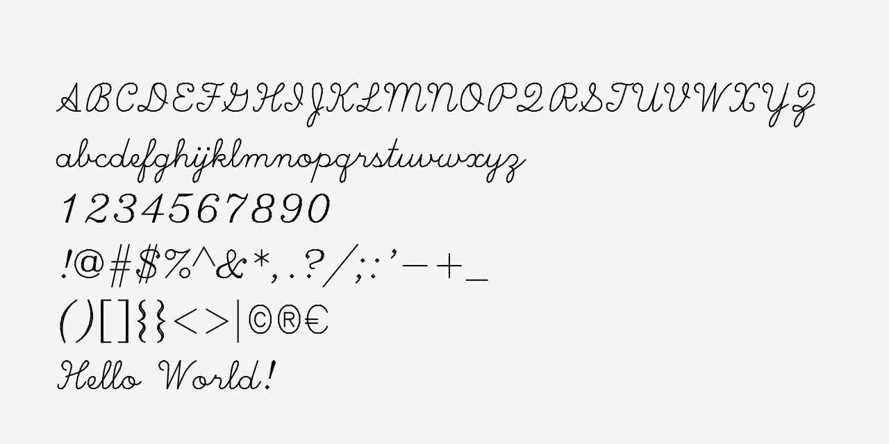

# plotSvg_svg_font_text Example

This example loads a single-line SVG font, and uses p5.plotSVG to plot it. Code is available: 

* [here, in this repo](sketch.js)
* [at Editor.p5js.org](https://editor.p5js.org/golan/sketches/rIsRh01Vj)
* [at openProcessing](https://openprocessing.org/sketch/2684135)

---

### Additional Information

Naturally, p5.plotSVG already supports standard (outline) typography from p5.js, as demonstrated in the [Smorgasbord example](../plotSvg_smorgasbord/README.md). In many plotter-oriented applications, however, it is desirable to use specialized ***single-line*** fonts (also called single-stroke or monoline fonts) instead of outline fonts.

This example provides a workflow for loading [SVG 1.1 Fonts](https://www.w3.org/TR/SVG11/fonts.html), a lesser-known open standard that allows for single-line vector fonts. Here is an [**archive of single-line SVG 1.1 fonts**](https://github.com/golanlevin/p5-single-line-font-resources/blob/main/p5_single_line_svg_fonts/single_line_svg_fonts/README.md), including various p5.js code for loading and displaying them. More generally, here is a [large repository of single-line fonts](https://github.com/golanlevin/p5-single-line-font-resources/blob/main/README.md) in various formats.

A [simplified example is also provided here](../plotSvg_hershey_text), in which a single-line font is directly inlined (i.e. hardcoded) into a p5.plotSvg project, eliminating the need to load an external font file. 

